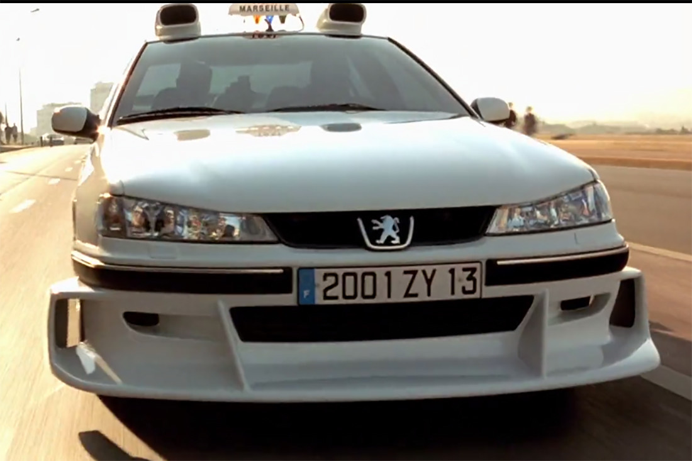

# 🚖 TAXI SERVICE 🚖

## Contents
___
- [Description](#Description)
- [Features](#Features)
- [Project structure](#Project-structure)
- [Technologies](#Technologies)
- [How to run project](#How-to-run-project)
___

## Description
This project is simple implementation of real taxi service app
___

## Features
- registration like a driver;
- authentication like a driver;
- create/update/remove a driver;
- create/update/remove a car;
- create/update/remove a manufacturer;
- display list of all drivers;
- display list of all cars;
- display list of all manufacturers;
- display all cars for authenticated driver;
___

## Project structure
Project is built on a three-tier architecture:
1. Presentation layer (controllers);
2. Application layer (service);
3. Data access layer (DAO)
### Table relation

___

## Technologies
- Apache Tomcat (v. 9.0.50)
- MySql
- JDBC
- Servlet
- JSP, JSTL
- HTML, CSS
- Maven
- Maven Checkstyle Plugin
___

## How to run project
### Necessary tools
- Intellij IDEA Ultimate
- MySql 
- Apache Tomcat
1. Clone this project
2. In MySql Workbench run query from init_db.sql
3. Add new configuration TomCat Local server
4. Change username and password in ConnectionUtil
5. Add absolute path to .log file in log4j2.xml file
